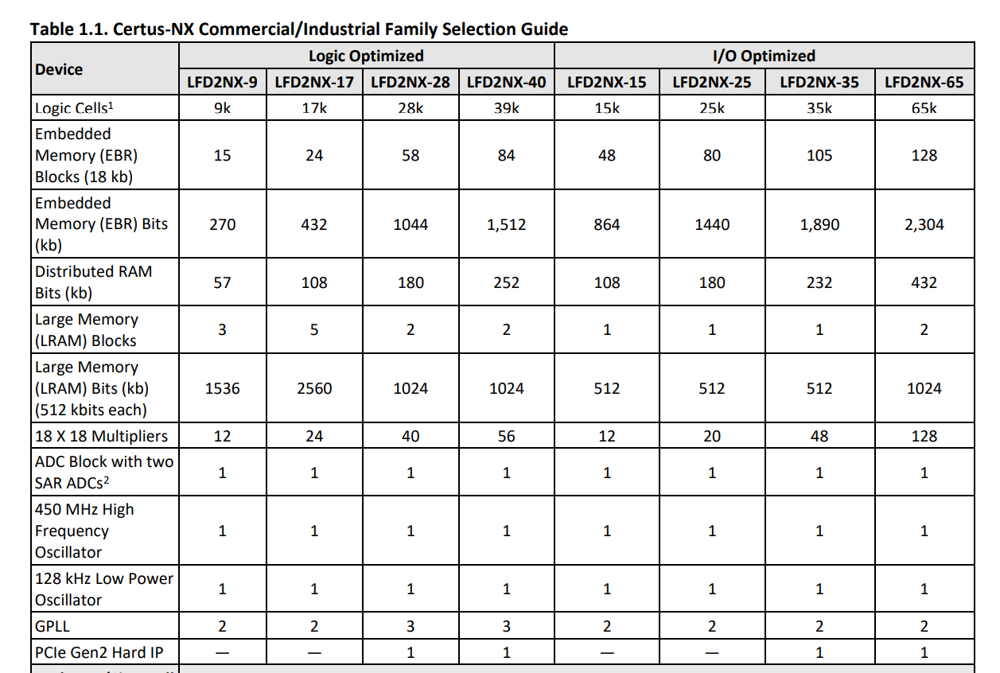
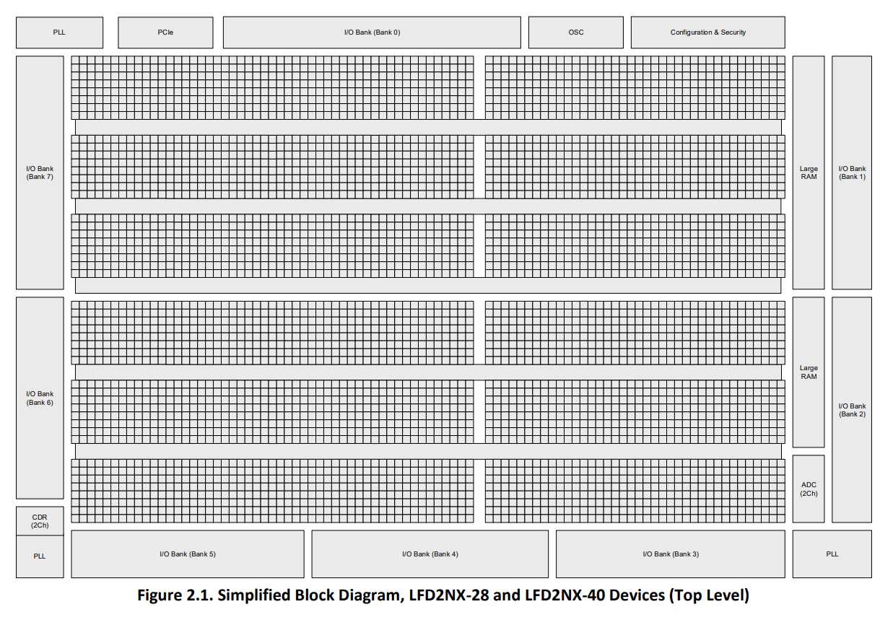
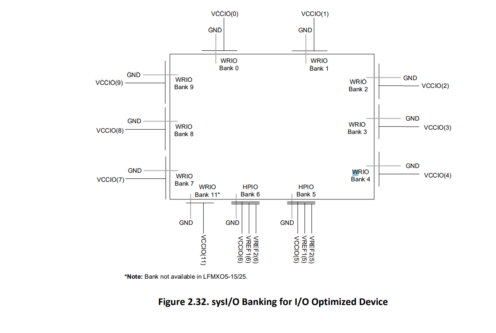
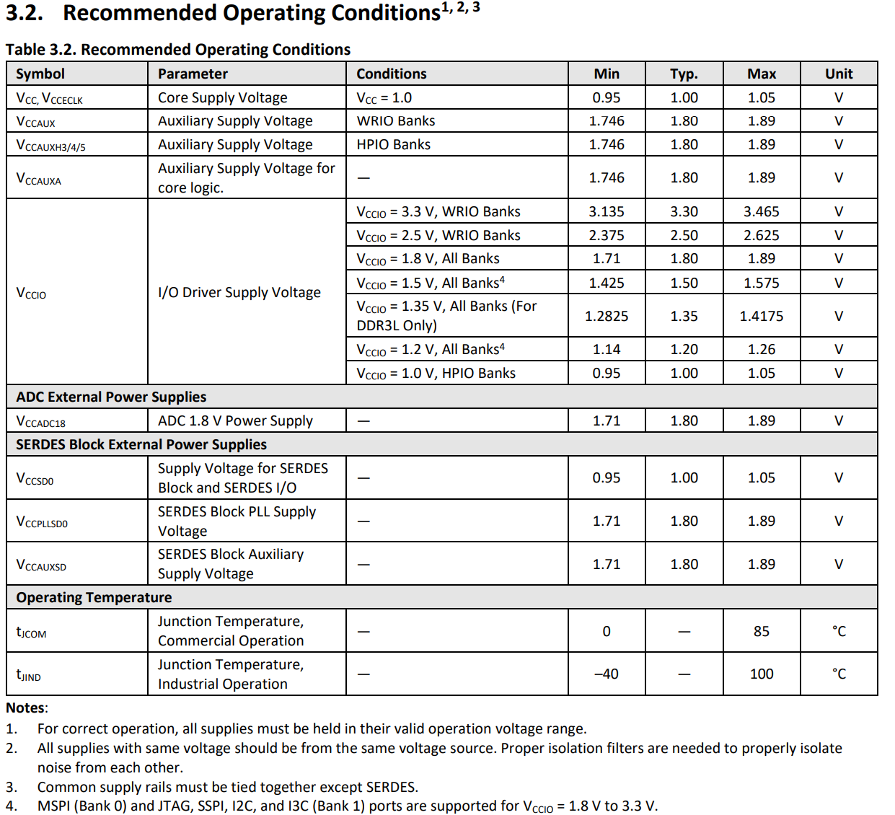

# Useful Links for the development

- [USB audio Library](https://www.youtube.com/watch?v=M9tjN_NaFpo)

- [USB C Power Diagram](https://www.st.com/resource/en/schematic_pack/mb1940-n657x0q-c02-schematic.pdf)

- [Data sheet FPGA](https://www.latticesemi.com/view_document?document_id=52890)

# Choses a se rappeler :

On est sur le LFD2NX-40-7B196I :
 - 196 Pour le BGA196
 - I pour Industriel donc -> Logic Optimized
 

 

 - Bilan de puissance : STM35H562 -> 3.3V@90mA + nRF24L01 -> 3.3V@15mA + DAC -> 5V@25 mA

# Plan d'alimentation 
On a différents types de banks : 

Et du coup on peut alimenter les WIRO en 3.3V et les HPIO en 1.8V 

et d'après **3.4** On a **pas de séquence d'alimenation** à implémenter grace a un système de surveillance interne.

 -> PMIC (AP7345D-1833RH4-7)

# Routage :

 - [Routage FPGA guide](file:/CoolPack/Development_Docs/FPGA-TN-02024-5-6-PCB-Layout-Rec-for-BGA%20Packages.pdf) voir page 18.

# Courses 
## Receiver 
 - [Batterie](https://www.gotronic.fr/art-accu-lipo-3-7-vcc-1500-mah-thym-bat-37198.htm)

 - [Ecran ePaper](https://www.mouser.fr/ProductDetail/Pervasive-Displays/E2213PS0E1?qs=vvQtp7zwQdOx1l1UOfNs8A%3D%3D)

